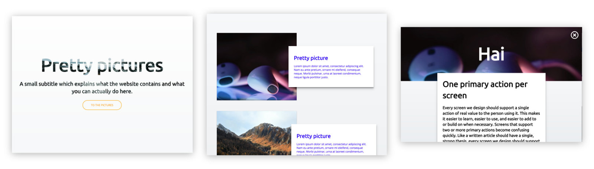

# web-design
The first demo for testing usability for the course 'webdesign'. I'll be creating an overview of different photo's, which provider a larger version of the photo and more information when you click on it. The user should have clear understanding what the site is about when they enter the website.
[Go to demo](https://jamalvr.github.io/web-design/.)

## Design principles used
For this assignment we must use at least three principles from the [list of 20 design principles.](http://bokardo.com/principles-of-user-interface-design/)

### First version
The first version of the design I made for the overview of 'pretty pictures'. With this design I can test it with users to see if the chosen principles work like they're supposed to.

#### "6 One primary action per screen"
Having one primary action per screen should make it easier to understand what a user should do. WHen there aree multiple primary actions, the user can become confused quite quickly. With this thought in mind, the user only has one primary action they can fulfill on each of the three screens I created.
- `June` actions are clear on each screen. The only weird thing is that the website is about pretty pictures and on the detailpage it looks like the main action is reading the information, instead of looking at the picture.
- `Martine`

#### "10 Consistency matters"
Only  elements that behave consistent should look consistent. There are numerous buttons/actions on the screens, and all of them behave differently and because they behave differently, they come with their own style. This way there is a clear distinction between the actions and that they behave differently.
- `June` The different actions look pretty clear. The contrast on the main action button can be a bit better.
- `Martine`

#### "11. Strong visual hierarchies work best"
In each screen I have tried to create a clear viewing order for the user. I've done this with different font-sizes, colors, backgrounds and panels that have a bigger `box shadow`.
- `June` The hierarchy on the different picture elements are not clear enough. My attention goes to the text first, because it's on top of the image instead of the way around. It's the same story on the detailpage, where the attention goes the text first, when the website is actually about pretty pictures.
- `Martine`
