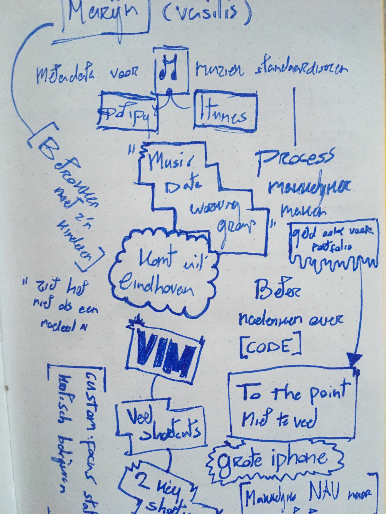
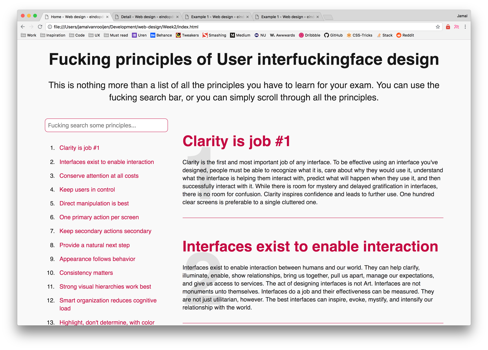
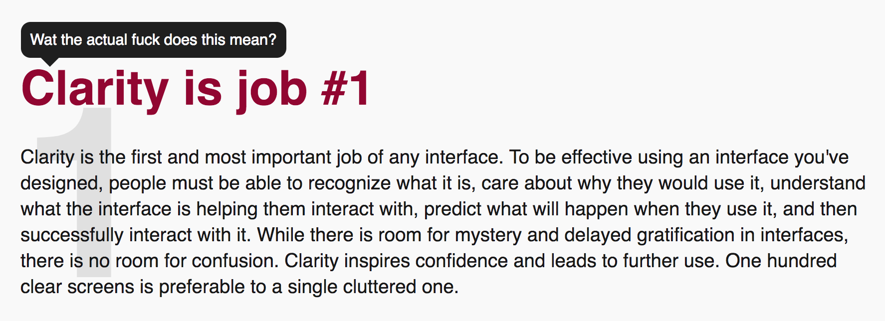
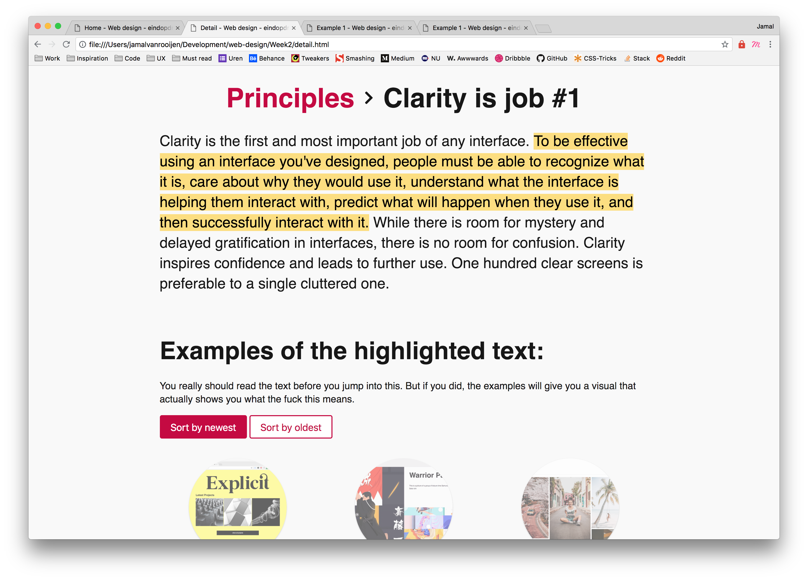
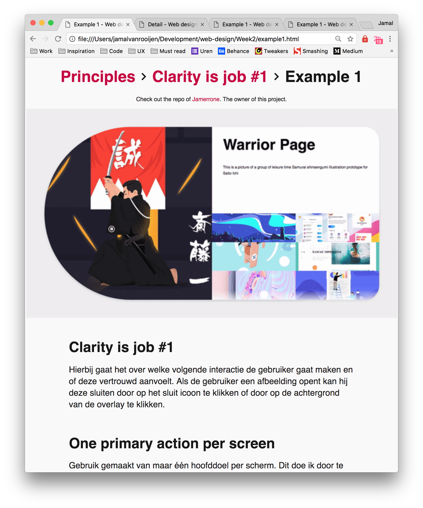

# [Webdesign eindopdracht](github.com/jamalvr/web-design/Week2)

Dit is mijn eindopdracht voor het vak web design. Ik had eerst gekozen voor de eindopdracht waar ik nieuwe vakpagina/moodle achtige omgeving zou neerzetten. Omdat ik voor de meesterproef al een minor gerelateerde website heb gemaakt, leek het mij leuk een andere opdracht te maken.

- [De opdracht](#opdracht-the-19-principles-of-user-interface-design)
- [User scenario's](#user-scenarios)
- [Marijn](#marijn)
- [De website](#de-website)
  - [Home](#home)
  - [Detailpagina](#detailpage-van-een-principe)
  - [Voorbeelden](#voorbeelden)
- [Future/to-do's](#future/to-dos)

## Opdracht: The 19 [Principles of User Interface Design](http://bokardo.com/principles-of-user-interface-design/)

De eerstejaars studenten van CMD krijgen een tentamen over al deze principes. Het is dus aan ons (in dit geval aan mij), om er voor te zorgen dat ze op een makkelijke manier de stof kunnen begrijpen. Want laten we nou wel eerlijk wezen.

Wanneer je voor het eerst een droge tekst leest waar je nog geen voorstelling bij hebt, snap je daar natuurlijk geen drol van. Om het makkelijk te maken wil ik meer context geven aan de droge tekst door middel van voorbeelden en text-highlighting.

### User scenario's:

- Als propedeuse student wil ik begrijpen wat belangrijke informatie is uit de tekst halen zodat ik een voldoende kan halen voor het tentamen.

- Als propedeuse student wil ik de context van de tekst begrijpen zodat ik het ook in de praktijk kan toepassen.

- Als propedeuse student wil ik snel kunnen vinden wat belangrijk is omdat ik geen zin heb om alle tekst te lezen.

- Als propedeuse student wil ik voorbeelden zien bij de tekst zodat ik de context van de informatie beter begrijp.

- Als propedeuse student die moet leren voor een tentamen wil ik gewoon snappen wat de fuck er nou eigenlijk echt staat.

### Marijn

Ik had als testpersoon Marijn. Helaas heb ik geen usertest met hem kunnen doen. Wel heb ik ervoor gezorgd dat de website helemaal werkt met `tab` en `space`. Omdat ik van tevoren wist dat ik niet meer hem ging testen, heb ik het wel toegankelijk gemaakt voor hem, maar niet zals hoofddoel gebruikt.

veel stukken tekst en elementen zijn to the point zoals hij dat graag ziet. Helaas heb ik verder nog geen gebruik gemaakt van extra functionaliteiten of shortkeys om het NOG makkelijker voor hem te maken.

### De website

De website heet "Fucking principles of user interfuckingface design". Dit is natuurlijk meer als een soort grapje om een droge tekst wat losser te maken. Zoals in het laatste scenario een beetje naar voren komt, is het voor studenten natuurlijk erg frustrerend om een droge tekst te leren waar ze geen "fuck" van snappen.

#### Home

De website bestaat uit een lange lijst met alle principes. Via de linker lijst kunnen mensen zoeken en filteren op bepaalde zoekwoorden. Met de zoekfunctie zou het makkelijker moeten zijn om door de lange lijst heen te ploeteren.

De tekst zelf heb ik expres redelijk droog gehouden, zodat de studenten het op z'n minst eerst even doorscannen. Wanneer de `:hover` op de titels van de principes wordt gebruikt, komt letterlijk de vraag naar voren die ze eigenlijk al de hele tijd in hun hoofd afvragen. Namelijk:

**what the actual fuck does this mean?**

#### Detailpage van een principe

Om vervolgens antwoord te geven op de vraag, is de belangrijkste kernzin uitgelicht op de detailpagina. Wanneer je op de zin drukt, scroll je meteen door naar voorbeelden. Door voorbeelden te laten zien, heeft de student meteen een idee van wat er bedoelt wordt.

De voorbeelden zijn sorteerbaar aan de hand van datum. Het doel is namelijk om te kijken of ze de context ook snappen door de jaren heen. Omdat het principe (in principe haha) hetzelfde blijft, maar misschien wel anders wordt toegepast.

De titels vanaf de detailpagina functioneren ook meteen als breadcrumbs. Zo kan de gebruiker altijd zien waar die is in de website en altijd terug navigeren.

#### Voorbeelden

Bij op de examplepagina kan je ook bovenaan meteen weer zien waar je als gebruiker in de flow zit. Door de afbeelding groot naar voren te laten komen, krijgen gebruikers meteen een goed beeld van het project.

Vervolgens worden de principes die per voorbeeld staan uitgelegd. De tekst is lekker groot, zodat het makkelijk leesbaar is voor iedereen.

#### Future/to-do's

- [ ] Vullen met meer content.
- [ ] Andere principes uitwerken, inclusief voorbeelden.
- [ ] Tijdens het scrollen op de homepagina aangeven op welk punt je zit.
- [ ] Nog meer uitleg bij de voorbeelden. Concrete elementen uitligten per principe adhv het voorbeeld.
- [ ] Timer om een x aantal seconden te hoveren of te focussen, voordat je pas kan doorklikken. Op deze manier forceer je de doelgroep eerst te laten lezen.
- [ ] Shortkeys maken om het NOG beter te maken voor Marijn.
